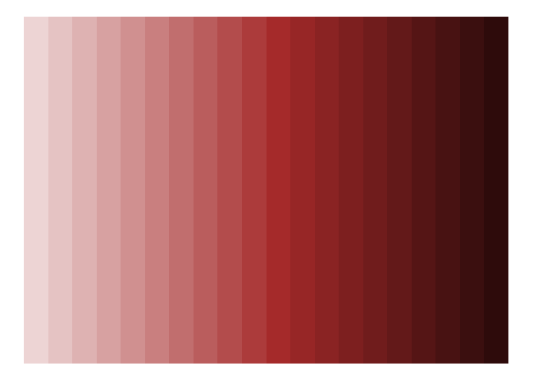
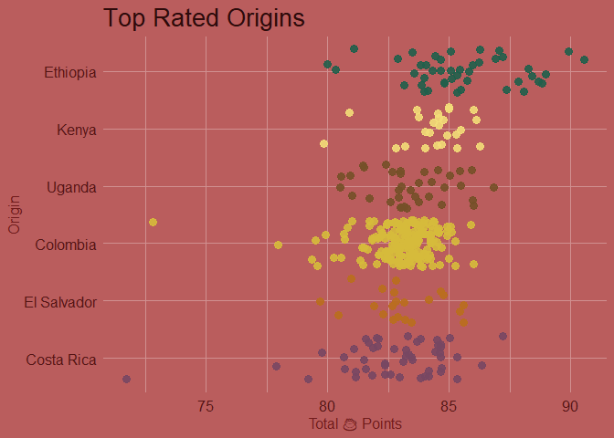
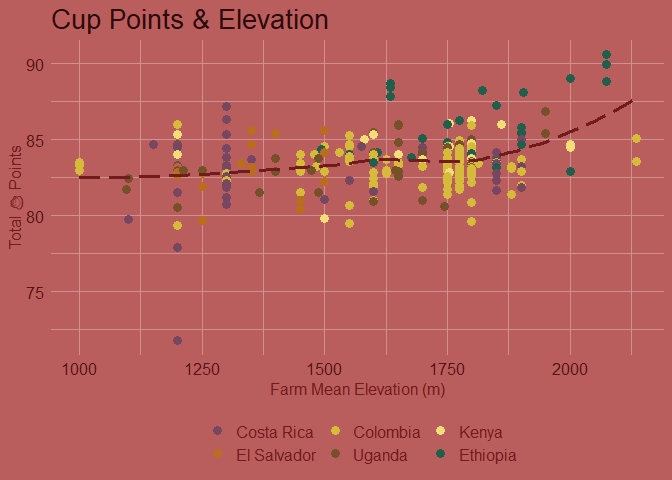
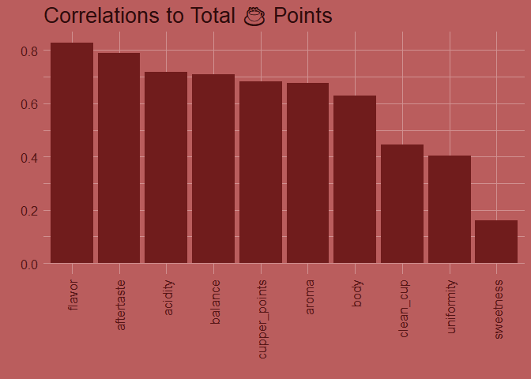
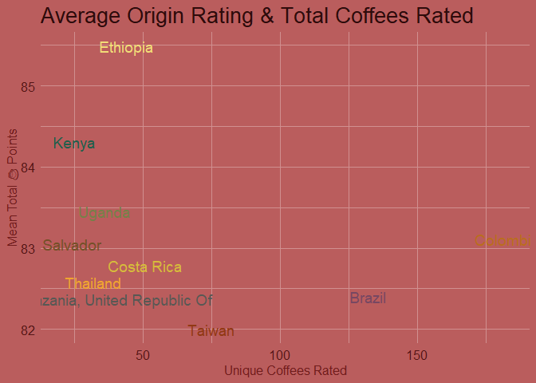

TidyTuesday \| Coffee Ratings
================
fth

## Coffee Rating Dataset

Exploring an older TidyTuesday dataset with new tools.

setup chunk:

``` r
library(dplyr)
```

    Warning: package 'dplyr' was built under R version 4.2.1


    Attaching package: 'dplyr'

    The following objects are masked from 'package:stats':

        filter, lag

    The following objects are masked from 'package:base':

        intersect, setdiff, setequal, union

``` r
library(tidyr)
```

    Warning: package 'tidyr' was built under R version 4.2.1

``` r
library(corrr) 
```

    Warning: package 'corrr' was built under R version 4.2.2

``` r
library(ggplot2)
```

    Warning: package 'ggplot2' was built under R version 4.2.1

``` r
library(gt)            
```

    Warning: package 'gt' was built under R version 4.2.2

``` r
library(patchwork)
```

    Warning: package 'patchwork' was built under R version 4.2.2

``` r
library(monochromeR)
```

    Warning: package 'monochromeR' was built under R version 4.2.2

``` r
library(PrettyCols)
```

    Warning: package 'PrettyCols' was built under R version 4.2.2

``` r
library(emo)
# emo::ji_find("hot_beverage")
emo::ji("hot_beverage") -> cup 
gt_grob <- function(gt_object, ...){
# https://github.com/rstudio/gt/issues/961  
  out_name <- file.path(
    tempfile(pattern = "file", tmpdir = tempdir(), fileext = ".png")
  )
  
  gtsave(gt_object, out_name, ...)
  
  in_png <- png::readPNG(out_name)
  
  on.exit(file.remove(out_name), add=TRUE)
  
  grid::rasterGrob(in_png)
  
}
```

get the dataset:

``` r
# tidytuesday coffee ---------------------------
coffee_ratings <- readr::read_csv('https://raw.githubusercontent.com/rfordatascience/tidytuesday/master/data/2020/2020-07-07/coffee_ratings.csv')
```

    Rows: 1339 Columns: 43
    ── Column specification ────────────────────────────────────────────────────────
    Delimiter: ","
    chr (24): species, owner, country_of_origin, farm_name, lot_number, mill, ic...
    dbl (19): total_cup_points, number_of_bags, aroma, flavor, aftertaste, acidi...

    ℹ Use `spec()` to retrieve the full column specification for this data.
    ℹ Specify the column types or set `show_col_types = FALSE` to quiet this message.

run some calculations:

``` r
# average rating by country  --
coffee_ratings %>% 
  group_by(country_of_origin) %>%
  summarize(
    mean_total_cup_pts = mean(total_cup_points)
  ) %>% 
  arrange(desc(mean_total_cup_pts)) -> average_rating_by_country


# average rating subgroups
coffee_ratings %>% 
  group_by(species, variety, processing_method) %>%
  summarize(
    mean_total_cup_pts = mean(total_cup_points, na.rm = TRUE),
    mean_alt = mean(altitude_mean_meters, na.rm = TRUE)
  ) %>% 
  arrange(desc(mean_total_cup_pts)) -> average_rating_groups
```

    `summarise()` has grouped output by 'species', 'variety'. You can override
    using the `.groups` argument.

``` r
# unique coffees -- 
coffee_ratings %>% 
  group_by(country_of_origin) %>% 
  count %>% 
  arrange(desc(n)) -> unique_coffees

# top rated with many coffees -- 
unique_coffees %>% 
  left_join(average_rating_by_country, 
            by = 'country_of_origin') %>% 
  ungroup() %>% 
  head(15) %>% # want top ranked origins with large variety
  arrange(desc(mean_total_cup_pts)) %>% 
  head(10) -> unique_coffees 
```

removing some unnecessary cols, & filtering on various row splices

``` r
# wrangling // filtering ----
coffee_filtered <- coffee_ratings %>% 
                   select(total_cup_points, species, country_of_origin, region, harvest_year,
                          variety:category_two_defects,
                          altitude_mean_meters) 

coffee_filtered %>% 
  filter(
    country_of_origin %in% unique_coffees$country_of_origin
    ) -> coffee_filtered
```

creating some colors and themes

``` r
brownie <- generate_palette("brown", modification = "go_both_ways", 
                                   n_colours = 20, 
                                   view_palette = TRUE, 
                                   view_labels = FALSE)
```



``` r
brown_theme <- theme(plot.background = element_rect(fill = brownie[8], 
                                                    colour = brownie[8]),
                     panel.grid = element_line(colour = brownie[5]),
                     panel.background = element_rect(fill = brownie[8], 
                                                     colour = brownie[8]),
                     text = element_text(colour = brownie[15]),
                     axis.text = element_text(colour = brownie[17]),
                     plot.title = element_text(colour = brownie[20], hjust = 0),
                     plot.subtitle = element_text(colour = brownie[18], hjust = 0)) + 
                theme(
                  axis.text =   element_text(size = 12),
                  plot.title =  element_text(size = 20),
                  plot.subtitle = element_text(size = 12),
                  axis.title =  element_text(size = 12),
                  legend.text = element_text(size = 12)
                )
```

# gt tables

``` r
# gt -----------------

# most unique and average rating
gt_countries <- unique_coffees %>% 
                # left_join(average_rating_by_country, 
                #           by = 'country_of_origin') %>% 
                # ungroup() %>% 
                # head(15) %>% # want countries with high variety (i.e. not 1 coffee:country)
                # arrange(desc(mean_total_cup_pts)) %>%
                # head(10) %>% # top ranks per high distinct counts
                gt() %>% 
                data_color(
                  columns = mean_total_cup_pts, 
                  colors = brownie
                ) %>% 
                fmt_number(
                  columns = mean_total_cup_pts
                ) %>% 
                tab_header(
                  title = paste0("Origin Samples & Mean Total ", cup, " Points ")
                ) %>% 
                cols_label(
                  country_of_origin  =   "Origin",
                  n =                    "Distinct Samples",
                  mean_total_cup_pts =   "Avg Rating"
                ) %>% 
               tab_options(table.background.color = brownie[5],
                           table_body.hlines.color = brownie[3],
                           column_labels.border.bottom.color = brownie[10],
                           heading.border.bottom.color = brownie[10])

gt:::as.tags.gt_tbl(gt_countries) # https://github.com/rstudio/gt/issues/823
```

<div id="dhusvacumu" style="padding-left:0px;padding-right:0px;padding-top:10px;padding-bottom:10px;overflow-x:auto;overflow-y:auto;width:auto;height:auto;">
<style>html {
  font-family: -apple-system, BlinkMacSystemFont, 'Segoe UI', Roboto, Oxygen, Ubuntu, Cantarell, 'Helvetica Neue', 'Fira Sans', 'Droid Sans', Arial, sans-serif;
}

#dhusvacumu .gt_table {
  display: table;
  border-collapse: collapse;
  margin-left: auto;
  margin-right: auto;
  color: #FFFFFF;
  font-size: 16px;
  font-weight: normal;
  font-style: normal;
  background-color: #D09090;
  width: auto;
  border-top-style: solid;
  border-top-width: 2px;
  border-top-color: #A8A8A8;
  border-right-style: none;
  border-right-width: 2px;
  border-right-color: #D3D3D3;
  border-bottom-style: solid;
  border-bottom-width: 2px;
  border-bottom-color: #A8A8A8;
  border-left-style: none;
  border-left-width: 2px;
  border-left-color: #D3D3D3;
}

#dhusvacumu .gt_heading {
  background-color: #D09090;
  text-align: center;
  border-bottom-color: #D09090;
  border-left-style: none;
  border-left-width: 1px;
  border-left-color: #D3D3D3;
  border-right-style: none;
  border-right-width: 1px;
  border-right-color: #D3D3D3;
}

#dhusvacumu .gt_caption {
  padding-top: 4px;
  padding-bottom: 4px;
}

#dhusvacumu .gt_title {
  color: #FFFFFF;
  font-size: 125%;
  font-weight: initial;
  padding-top: 4px;
  padding-bottom: 4px;
  padding-left: 5px;
  padding-right: 5px;
  border-bottom-color: #D09090;
  border-bottom-width: 0;
}

#dhusvacumu .gt_subtitle {
  color: #FFFFFF;
  font-size: 85%;
  font-weight: initial;
  padding-top: 0;
  padding-bottom: 6px;
  padding-left: 5px;
  padding-right: 5px;
  border-top-color: #D09090;
  border-top-width: 0;
}

#dhusvacumu .gt_bottom_border {
  border-bottom-style: solid;
  border-bottom-width: 2px;
  border-bottom-color: #AC3B3B;
}

#dhusvacumu .gt_col_headings {
  border-top-style: solid;
  border-top-width: 2px;
  border-top-color: #D3D3D3;
  border-bottom-style: solid;
  border-bottom-width: 2px;
  border-bottom-color: #AC3B3B;
  border-left-style: none;
  border-left-width: 1px;
  border-left-color: #D3D3D3;
  border-right-style: none;
  border-right-width: 1px;
  border-right-color: #D3D3D3;
}

#dhusvacumu .gt_col_heading {
  color: #FFFFFF;
  background-color: #D09090;
  font-size: 100%;
  font-weight: normal;
  text-transform: inherit;
  border-left-style: none;
  border-left-width: 1px;
  border-left-color: #D3D3D3;
  border-right-style: none;
  border-right-width: 1px;
  border-right-color: #D3D3D3;
  vertical-align: bottom;
  padding-top: 5px;
  padding-bottom: 6px;
  padding-left: 5px;
  padding-right: 5px;
  overflow-x: hidden;
}

#dhusvacumu .gt_column_spanner_outer {
  color: #FFFFFF;
  background-color: #D09090;
  font-size: 100%;
  font-weight: normal;
  text-transform: inherit;
  padding-top: 0;
  padding-bottom: 0;
  padding-left: 4px;
  padding-right: 4px;
}

#dhusvacumu .gt_column_spanner_outer:first-child {
  padding-left: 0;
}

#dhusvacumu .gt_column_spanner_outer:last-child {
  padding-right: 0;
}

#dhusvacumu .gt_column_spanner {
  border-bottom-style: solid;
  border-bottom-width: 2px;
  border-bottom-color: #AC3B3B;
  vertical-align: bottom;
  padding-top: 5px;
  padding-bottom: 5px;
  overflow-x: hidden;
  display: inline-block;
  width: 100%;
}

#dhusvacumu .gt_group_heading {
  padding-top: 8px;
  padding-bottom: 8px;
  padding-left: 5px;
  padding-right: 5px;
  color: #FFFFFF;
  background-color: #D09090;
  font-size: 100%;
  font-weight: initial;
  text-transform: inherit;
  border-top-style: solid;
  border-top-width: 2px;
  border-top-color: #D3D3D3;
  border-bottom-style: solid;
  border-bottom-width: 2px;
  border-bottom-color: #D3D3D3;
  border-left-style: none;
  border-left-width: 1px;
  border-left-color: #D3D3D3;
  border-right-style: none;
  border-right-width: 1px;
  border-right-color: #D3D3D3;
  vertical-align: middle;
  text-align: left;
}

#dhusvacumu .gt_empty_group_heading {
  padding: 0.5px;
  color: #FFFFFF;
  background-color: #D09090;
  font-size: 100%;
  font-weight: initial;
  border-top-style: solid;
  border-top-width: 2px;
  border-top-color: #D3D3D3;
  border-bottom-style: solid;
  border-bottom-width: 2px;
  border-bottom-color: #D3D3D3;
  vertical-align: middle;
}

#dhusvacumu .gt_from_md > :first-child {
  margin-top: 0;
}

#dhusvacumu .gt_from_md > :last-child {
  margin-bottom: 0;
}

#dhusvacumu .gt_row {
  padding-top: 8px;
  padding-bottom: 8px;
  padding-left: 5px;
  padding-right: 5px;
  margin: 10px;
  border-top-style: solid;
  border-top-width: 1px;
  border-top-color: #DEB2B2;
  border-left-style: none;
  border-left-width: 1px;
  border-left-color: #D3D3D3;
  border-right-style: none;
  border-right-width: 1px;
  border-right-color: #D3D3D3;
  vertical-align: middle;
  overflow-x: hidden;
}

#dhusvacumu .gt_stub {
  color: #FFFFFF;
  background-color: #D09090;
  font-size: 100%;
  font-weight: initial;
  text-transform: inherit;
  border-right-style: solid;
  border-right-width: 2px;
  border-right-color: #D3D3D3;
  padding-left: 5px;
  padding-right: 5px;
}

#dhusvacumu .gt_stub_row_group {
  color: #FFFFFF;
  background-color: #D09090;
  font-size: 100%;
  font-weight: initial;
  text-transform: inherit;
  border-right-style: solid;
  border-right-width: 2px;
  border-right-color: #D3D3D3;
  padding-left: 5px;
  padding-right: 5px;
  vertical-align: top;
}

#dhusvacumu .gt_row_group_first td {
  border-top-width: 2px;
}

#dhusvacumu .gt_summary_row {
  color: #FFFFFF;
  background-color: #D09090;
  text-transform: inherit;
  padding-top: 8px;
  padding-bottom: 8px;
  padding-left: 5px;
  padding-right: 5px;
}

#dhusvacumu .gt_first_summary_row {
  border-top-style: solid;
  border-top-color: #D3D3D3;
}

#dhusvacumu .gt_first_summary_row.thick {
  border-top-width: 2px;
}

#dhusvacumu .gt_last_summary_row {
  padding-top: 8px;
  padding-bottom: 8px;
  padding-left: 5px;
  padding-right: 5px;
  border-bottom-style: solid;
  border-bottom-width: 2px;
  border-bottom-color: #D3D3D3;
}

#dhusvacumu .gt_grand_summary_row {
  color: #FFFFFF;
  background-color: #D09090;
  text-transform: inherit;
  padding-top: 8px;
  padding-bottom: 8px;
  padding-left: 5px;
  padding-right: 5px;
}

#dhusvacumu .gt_first_grand_summary_row {
  padding-top: 8px;
  padding-bottom: 8px;
  padding-left: 5px;
  padding-right: 5px;
  border-top-style: double;
  border-top-width: 6px;
  border-top-color: #D3D3D3;
}

#dhusvacumu .gt_striped {
  background-color: rgba(128, 128, 128, 0.05);
}

#dhusvacumu .gt_table_body {
  border-top-style: solid;
  border-top-width: 2px;
  border-top-color: #D3D3D3;
  border-bottom-style: solid;
  border-bottom-width: 2px;
  border-bottom-color: #D3D3D3;
}

#dhusvacumu .gt_footnotes {
  color: #FFFFFF;
  background-color: #D09090;
  border-bottom-style: none;
  border-bottom-width: 2px;
  border-bottom-color: #D3D3D3;
  border-left-style: none;
  border-left-width: 2px;
  border-left-color: #D3D3D3;
  border-right-style: none;
  border-right-width: 2px;
  border-right-color: #D3D3D3;
}

#dhusvacumu .gt_footnote {
  margin: 0px;
  font-size: 90%;
  padding-left: 4px;
  padding-right: 4px;
  padding-left: 5px;
  padding-right: 5px;
}

#dhusvacumu .gt_sourcenotes {
  color: #FFFFFF;
  background-color: #D09090;
  border-bottom-style: none;
  border-bottom-width: 2px;
  border-bottom-color: #D3D3D3;
  border-left-style: none;
  border-left-width: 2px;
  border-left-color: #D3D3D3;
  border-right-style: none;
  border-right-width: 2px;
  border-right-color: #D3D3D3;
}

#dhusvacumu .gt_sourcenote {
  font-size: 90%;
  padding-top: 4px;
  padding-bottom: 4px;
  padding-left: 5px;
  padding-right: 5px;
}

#dhusvacumu .gt_left {
  text-align: left;
}

#dhusvacumu .gt_center {
  text-align: center;
}

#dhusvacumu .gt_right {
  text-align: right;
  font-variant-numeric: tabular-nums;
}

#dhusvacumu .gt_font_normal {
  font-weight: normal;
}

#dhusvacumu .gt_font_bold {
  font-weight: bold;
}

#dhusvacumu .gt_font_italic {
  font-style: italic;
}

#dhusvacumu .gt_super {
  font-size: 65%;
}

#dhusvacumu .gt_footnote_marks {
  font-style: italic;
  font-weight: normal;
  font-size: 75%;
  vertical-align: 0.4em;
}

#dhusvacumu .gt_asterisk {
  font-size: 100%;
  vertical-align: 0;
}

#dhusvacumu .gt_indent_1 {
  text-indent: 5px;
}

#dhusvacumu .gt_indent_2 {
  text-indent: 10px;
}

#dhusvacumu .gt_indent_3 {
  text-indent: 15px;
}

#dhusvacumu .gt_indent_4 {
  text-indent: 20px;
}

#dhusvacumu .gt_indent_5 {
  text-indent: 25px;
}
</style>
<table class="gt_table">
  <thead class="gt_header">
    <tr>
      <td colspan="3" class="gt_heading gt_title gt_font_normal gt_bottom_border" style>Origin Samples &amp; Mean Total ☕ Points </td>
    </tr>
    
  </thead>
  <thead class="gt_col_headings">
    <tr>
      <th class="gt_col_heading gt_columns_bottom_border gt_left" rowspan="1" colspan="1" scope="col" id="Origin">Origin</th>
      <th class="gt_col_heading gt_columns_bottom_border gt_right" rowspan="1" colspan="1" scope="col" id="Distinct Samples">Distinct Samples</th>
      <th class="gt_col_heading gt_columns_bottom_border gt_right" rowspan="1" colspan="1" scope="col" id="Avg Rating">Avg Rating</th>
    </tr>
  </thead>
  <tbody class="gt_table_body">
    <tr><td headers="country_of_origin" class="gt_row gt_left">Ethiopia</td>
<td headers="n" class="gt_row gt_right">44</td>
<td headers="mean_total_cup_pts" class="gt_row gt_right" style="background-color: #2E0B0B; color: #FFFFFF;">85.48</td></tr>
    <tr><td headers="country_of_origin" class="gt_row gt_left">Kenya</td>
<td headers="n" class="gt_row gt_right">25</td>
<td headers="mean_total_cup_pts" class="gt_row gt_right" style="background-color: #822121; color: #FFFFFF;">84.31</td></tr>
    <tr><td headers="country_of_origin" class="gt_row gt_left">Uganda</td>
<td headers="n" class="gt_row gt_right">36</td>
<td headers="mean_total_cup_pts" class="gt_row gt_right" style="background-color: #B44D4D; color: #FFFFFF;">83.45</td></tr>
    <tr><td headers="country_of_origin" class="gt_row gt_left">Colombia</td>
<td headers="n" class="gt_row gt_right">183</td>
<td headers="mean_total_cup_pts" class="gt_row gt_right" style="background-color: #C16E6D; color: #FFFFFF;">83.11</td></tr>
    <tr><td headers="country_of_origin" class="gt_row gt_left">El Salvador</td>
<td headers="n" class="gt_row gt_right">21</td>
<td headers="mean_total_cup_pts" class="gt_row gt_right" style="background-color: #C37272; color: #FFFFFF;">83.05</td></tr>
    <tr><td headers="country_of_origin" class="gt_row gt_left">Costa Rica</td>
<td headers="n" class="gt_row gt_right">51</td>
<td headers="mean_total_cup_pts" class="gt_row gt_right" style="background-color: #CE8B8B; color: #FFFFFF;">82.79</td></tr>
    <tr><td headers="country_of_origin" class="gt_row gt_left">Thailand</td>
<td headers="n" class="gt_row gt_right">32</td>
<td headers="mean_total_cup_pts" class="gt_row gt_right" style="background-color: #D69F9F; color: #000000;">82.57</td></tr>
    <tr><td headers="country_of_origin" class="gt_row gt_left">Brazil</td>
<td headers="n" class="gt_row gt_right">132</td>
<td headers="mean_total_cup_pts" class="gt_row gt_right" style="background-color: #DDAEAE; color: #000000;">82.41</td></tr>
    <tr><td headers="country_of_origin" class="gt_row gt_left">Tanzania, United Republic Of</td>
<td headers="n" class="gt_row gt_right">40</td>
<td headers="mean_total_cup_pts" class="gt_row gt_right" style="background-color: #DEB2B2; color: #000000;">82.37</td></tr>
    <tr><td headers="country_of_origin" class="gt_row gt_left">Taiwan</td>
<td headers="n" class="gt_row gt_right">75</td>
<td headers="mean_total_cup_pts" class="gt_row gt_right" style="background-color: #EDD4D4; color: #000000;">82.00</td></tr>
  </tbody>
  
  
</table>
</div>

``` r
# top corrs to cup points
gt_corrs <-
  coffee_filtered %>% 
  select(total_cup_points, aroma:cupper_points) %>% 
  correlate() %>%
  focus(total_cup_points) %>% 
  arrange(desc(total_cup_points)) %>% 
  gt() %>% 
  data_color(
    columns = total_cup_points, 
    colors = brownie
  ) %>% 
  fmt_number(
    columns = total_cup_points
  ) %>%
  tab_header(
    title = paste0(cup, " Points & Rating Correlations")
  ) %>% 
  cols_label(
    total_cup_points  =   "Total Cup Correlation",
    term =                "Other Ratings",
  ) %>% 
  tab_options(table.background.color = brownie[5],
              table_body.hlines.color = brownie[3],
              column_labels.border.bottom.color = brownie[10],
              heading.border.bottom.color = brownie[10])
```

    Correlation computed with
    • Method: 'pearson'
    • Missing treated using: 'pairwise.complete.obs'

``` r
gt:::as.tags.gt_tbl(gt_corrs)
```

<div id="lyyauxslbm" style="padding-left:0px;padding-right:0px;padding-top:10px;padding-bottom:10px;overflow-x:auto;overflow-y:auto;width:auto;height:auto;">
<style>html {
  font-family: -apple-system, BlinkMacSystemFont, 'Segoe UI', Roboto, Oxygen, Ubuntu, Cantarell, 'Helvetica Neue', 'Fira Sans', 'Droid Sans', Arial, sans-serif;
}

#lyyauxslbm .gt_table {
  display: table;
  border-collapse: collapse;
  margin-left: auto;
  margin-right: auto;
  color: #FFFFFF;
  font-size: 16px;
  font-weight: normal;
  font-style: normal;
  background-color: #D09090;
  width: auto;
  border-top-style: solid;
  border-top-width: 2px;
  border-top-color: #A8A8A8;
  border-right-style: none;
  border-right-width: 2px;
  border-right-color: #D3D3D3;
  border-bottom-style: solid;
  border-bottom-width: 2px;
  border-bottom-color: #A8A8A8;
  border-left-style: none;
  border-left-width: 2px;
  border-left-color: #D3D3D3;
}

#lyyauxslbm .gt_heading {
  background-color: #D09090;
  text-align: center;
  border-bottom-color: #D09090;
  border-left-style: none;
  border-left-width: 1px;
  border-left-color: #D3D3D3;
  border-right-style: none;
  border-right-width: 1px;
  border-right-color: #D3D3D3;
}

#lyyauxslbm .gt_caption {
  padding-top: 4px;
  padding-bottom: 4px;
}

#lyyauxslbm .gt_title {
  color: #FFFFFF;
  font-size: 125%;
  font-weight: initial;
  padding-top: 4px;
  padding-bottom: 4px;
  padding-left: 5px;
  padding-right: 5px;
  border-bottom-color: #D09090;
  border-bottom-width: 0;
}

#lyyauxslbm .gt_subtitle {
  color: #FFFFFF;
  font-size: 85%;
  font-weight: initial;
  padding-top: 0;
  padding-bottom: 6px;
  padding-left: 5px;
  padding-right: 5px;
  border-top-color: #D09090;
  border-top-width: 0;
}

#lyyauxslbm .gt_bottom_border {
  border-bottom-style: solid;
  border-bottom-width: 2px;
  border-bottom-color: #AC3B3B;
}

#lyyauxslbm .gt_col_headings {
  border-top-style: solid;
  border-top-width: 2px;
  border-top-color: #D3D3D3;
  border-bottom-style: solid;
  border-bottom-width: 2px;
  border-bottom-color: #AC3B3B;
  border-left-style: none;
  border-left-width: 1px;
  border-left-color: #D3D3D3;
  border-right-style: none;
  border-right-width: 1px;
  border-right-color: #D3D3D3;
}

#lyyauxslbm .gt_col_heading {
  color: #FFFFFF;
  background-color: #D09090;
  font-size: 100%;
  font-weight: normal;
  text-transform: inherit;
  border-left-style: none;
  border-left-width: 1px;
  border-left-color: #D3D3D3;
  border-right-style: none;
  border-right-width: 1px;
  border-right-color: #D3D3D3;
  vertical-align: bottom;
  padding-top: 5px;
  padding-bottom: 6px;
  padding-left: 5px;
  padding-right: 5px;
  overflow-x: hidden;
}

#lyyauxslbm .gt_column_spanner_outer {
  color: #FFFFFF;
  background-color: #D09090;
  font-size: 100%;
  font-weight: normal;
  text-transform: inherit;
  padding-top: 0;
  padding-bottom: 0;
  padding-left: 4px;
  padding-right: 4px;
}

#lyyauxslbm .gt_column_spanner_outer:first-child {
  padding-left: 0;
}

#lyyauxslbm .gt_column_spanner_outer:last-child {
  padding-right: 0;
}

#lyyauxslbm .gt_column_spanner {
  border-bottom-style: solid;
  border-bottom-width: 2px;
  border-bottom-color: #AC3B3B;
  vertical-align: bottom;
  padding-top: 5px;
  padding-bottom: 5px;
  overflow-x: hidden;
  display: inline-block;
  width: 100%;
}

#lyyauxslbm .gt_group_heading {
  padding-top: 8px;
  padding-bottom: 8px;
  padding-left: 5px;
  padding-right: 5px;
  color: #FFFFFF;
  background-color: #D09090;
  font-size: 100%;
  font-weight: initial;
  text-transform: inherit;
  border-top-style: solid;
  border-top-width: 2px;
  border-top-color: #D3D3D3;
  border-bottom-style: solid;
  border-bottom-width: 2px;
  border-bottom-color: #D3D3D3;
  border-left-style: none;
  border-left-width: 1px;
  border-left-color: #D3D3D3;
  border-right-style: none;
  border-right-width: 1px;
  border-right-color: #D3D3D3;
  vertical-align: middle;
  text-align: left;
}

#lyyauxslbm .gt_empty_group_heading {
  padding: 0.5px;
  color: #FFFFFF;
  background-color: #D09090;
  font-size: 100%;
  font-weight: initial;
  border-top-style: solid;
  border-top-width: 2px;
  border-top-color: #D3D3D3;
  border-bottom-style: solid;
  border-bottom-width: 2px;
  border-bottom-color: #D3D3D3;
  vertical-align: middle;
}

#lyyauxslbm .gt_from_md > :first-child {
  margin-top: 0;
}

#lyyauxslbm .gt_from_md > :last-child {
  margin-bottom: 0;
}

#lyyauxslbm .gt_row {
  padding-top: 8px;
  padding-bottom: 8px;
  padding-left: 5px;
  padding-right: 5px;
  margin: 10px;
  border-top-style: solid;
  border-top-width: 1px;
  border-top-color: #DEB2B2;
  border-left-style: none;
  border-left-width: 1px;
  border-left-color: #D3D3D3;
  border-right-style: none;
  border-right-width: 1px;
  border-right-color: #D3D3D3;
  vertical-align: middle;
  overflow-x: hidden;
}

#lyyauxslbm .gt_stub {
  color: #FFFFFF;
  background-color: #D09090;
  font-size: 100%;
  font-weight: initial;
  text-transform: inherit;
  border-right-style: solid;
  border-right-width: 2px;
  border-right-color: #D3D3D3;
  padding-left: 5px;
  padding-right: 5px;
}

#lyyauxslbm .gt_stub_row_group {
  color: #FFFFFF;
  background-color: #D09090;
  font-size: 100%;
  font-weight: initial;
  text-transform: inherit;
  border-right-style: solid;
  border-right-width: 2px;
  border-right-color: #D3D3D3;
  padding-left: 5px;
  padding-right: 5px;
  vertical-align: top;
}

#lyyauxslbm .gt_row_group_first td {
  border-top-width: 2px;
}

#lyyauxslbm .gt_summary_row {
  color: #FFFFFF;
  background-color: #D09090;
  text-transform: inherit;
  padding-top: 8px;
  padding-bottom: 8px;
  padding-left: 5px;
  padding-right: 5px;
}

#lyyauxslbm .gt_first_summary_row {
  border-top-style: solid;
  border-top-color: #D3D3D3;
}

#lyyauxslbm .gt_first_summary_row.thick {
  border-top-width: 2px;
}

#lyyauxslbm .gt_last_summary_row {
  padding-top: 8px;
  padding-bottom: 8px;
  padding-left: 5px;
  padding-right: 5px;
  border-bottom-style: solid;
  border-bottom-width: 2px;
  border-bottom-color: #D3D3D3;
}

#lyyauxslbm .gt_grand_summary_row {
  color: #FFFFFF;
  background-color: #D09090;
  text-transform: inherit;
  padding-top: 8px;
  padding-bottom: 8px;
  padding-left: 5px;
  padding-right: 5px;
}

#lyyauxslbm .gt_first_grand_summary_row {
  padding-top: 8px;
  padding-bottom: 8px;
  padding-left: 5px;
  padding-right: 5px;
  border-top-style: double;
  border-top-width: 6px;
  border-top-color: #D3D3D3;
}

#lyyauxslbm .gt_striped {
  background-color: rgba(128, 128, 128, 0.05);
}

#lyyauxslbm .gt_table_body {
  border-top-style: solid;
  border-top-width: 2px;
  border-top-color: #D3D3D3;
  border-bottom-style: solid;
  border-bottom-width: 2px;
  border-bottom-color: #D3D3D3;
}

#lyyauxslbm .gt_footnotes {
  color: #FFFFFF;
  background-color: #D09090;
  border-bottom-style: none;
  border-bottom-width: 2px;
  border-bottom-color: #D3D3D3;
  border-left-style: none;
  border-left-width: 2px;
  border-left-color: #D3D3D3;
  border-right-style: none;
  border-right-width: 2px;
  border-right-color: #D3D3D3;
}

#lyyauxslbm .gt_footnote {
  margin: 0px;
  font-size: 90%;
  padding-left: 4px;
  padding-right: 4px;
  padding-left: 5px;
  padding-right: 5px;
}

#lyyauxslbm .gt_sourcenotes {
  color: #FFFFFF;
  background-color: #D09090;
  border-bottom-style: none;
  border-bottom-width: 2px;
  border-bottom-color: #D3D3D3;
  border-left-style: none;
  border-left-width: 2px;
  border-left-color: #D3D3D3;
  border-right-style: none;
  border-right-width: 2px;
  border-right-color: #D3D3D3;
}

#lyyauxslbm .gt_sourcenote {
  font-size: 90%;
  padding-top: 4px;
  padding-bottom: 4px;
  padding-left: 5px;
  padding-right: 5px;
}

#lyyauxslbm .gt_left {
  text-align: left;
}

#lyyauxslbm .gt_center {
  text-align: center;
}

#lyyauxslbm .gt_right {
  text-align: right;
  font-variant-numeric: tabular-nums;
}

#lyyauxslbm .gt_font_normal {
  font-weight: normal;
}

#lyyauxslbm .gt_font_bold {
  font-weight: bold;
}

#lyyauxslbm .gt_font_italic {
  font-style: italic;
}

#lyyauxslbm .gt_super {
  font-size: 65%;
}

#lyyauxslbm .gt_footnote_marks {
  font-style: italic;
  font-weight: normal;
  font-size: 75%;
  vertical-align: 0.4em;
}

#lyyauxslbm .gt_asterisk {
  font-size: 100%;
  vertical-align: 0;
}

#lyyauxslbm .gt_indent_1 {
  text-indent: 5px;
}

#lyyauxslbm .gt_indent_2 {
  text-indent: 10px;
}

#lyyauxslbm .gt_indent_3 {
  text-indent: 15px;
}

#lyyauxslbm .gt_indent_4 {
  text-indent: 20px;
}

#lyyauxslbm .gt_indent_5 {
  text-indent: 25px;
}
</style>
<table class="gt_table">
  <thead class="gt_header">
    <tr>
      <td colspan="2" class="gt_heading gt_title gt_font_normal gt_bottom_border" style>☕ Points &amp; Rating Correlations</td>
    </tr>
    
  </thead>
  <thead class="gt_col_headings">
    <tr>
      <th class="gt_col_heading gt_columns_bottom_border gt_left" rowspan="1" colspan="1" scope="col" id="Other Ratings">Other Ratings</th>
      <th class="gt_col_heading gt_columns_bottom_border gt_right" rowspan="1" colspan="1" scope="col" id="Total Cup Correlation">Total Cup Correlation</th>
    </tr>
  </thead>
  <tbody class="gt_table_body">
    <tr><td headers="term" class="gt_row gt_left">flavor</td>
<td headers="total_cup_points" class="gt_row gt_right" style="background-color: #2E0B0B; color: #FFFFFF;">0.83</td></tr>
    <tr><td headers="term" class="gt_row gt_left">aftertaste</td>
<td headers="total_cup_points" class="gt_row gt_right" style="background-color: #3C0F0F; color: #FFFFFF;">0.79</td></tr>
    <tr><td headers="term" class="gt_row gt_left">acidity</td>
<td headers="total_cup_points" class="gt_row gt_right" style="background-color: #561515; color: #FFFFFF;">0.72</td></tr>
    <tr><td headers="term" class="gt_row gt_left">balance</td>
<td headers="total_cup_points" class="gt_row gt_right" style="background-color: #5A1616; color: #FFFFFF;">0.71</td></tr>
    <tr><td headers="term" class="gt_row gt_left">cupper_points</td>
<td headers="total_cup_points" class="gt_row gt_right" style="background-color: #651919; color: #FFFFFF;">0.68</td></tr>
    <tr><td headers="term" class="gt_row gt_left">aroma</td>
<td headers="total_cup_points" class="gt_row gt_right" style="background-color: #671A1A; color: #FFFFFF;">0.68</td></tr>
    <tr><td headers="term" class="gt_row gt_left">body</td>
<td headers="total_cup_points" class="gt_row gt_right" style="background-color: #791E1E; color: #FFFFFF;">0.63</td></tr>
    <tr><td headers="term" class="gt_row gt_left">clean_cup</td>
<td headers="total_cup_points" class="gt_row gt_right" style="background-color: #B24A4A; color: #FFFFFF;">0.44</td></tr>
    <tr><td headers="term" class="gt_row gt_left">uniformity</td>
<td headers="total_cup_points" class="gt_row gt_right" style="background-color: #BA5E5E; color: #FFFFFF;">0.40</td></tr>
    <tr><td headers="term" class="gt_row gt_left">sweetness</td>
<td headers="total_cup_points" class="gt_row gt_right" style="background-color: #EDD4D4; color: #000000;">0.16</td></tr>
  </tbody>
  
  
</table>
</div>

# gg section

``` r
# gg -------------------
top_countries <- c("Ethiopia", "Kenya", "Uganda", "Costa Rica", "Colombia", "El Salvador")

gg_elev <- 
coffee_filtered %>%
  filter(country_of_origin %in% top_countries) %>% 
  filter(altitude_mean_meters < 2500) %>% 
  filter(altitude_mean_meters > 600) %>% 
  filter(total_cup_points > 50) %>% 
  mutate(
    country_of_origin = forcats::fct_reorder(country_of_origin, total_cup_points, .fun='mean')
  ) %>% 
  ggplot(.) + 
  geom_point(aes(x = altitude_mean_meters, y = total_cup_points, 
                 color = country_of_origin), size = 3) + 
  geom_smooth(aes(x = altitude_mean_meters, y = total_cup_points), 
              color = brownie[15], 
              se = FALSE, linetype = "longdash", size = 1.2) + 
  labs(
    title = "Cup Points & Elevation",
    x = "Farm Mean Elevation (m)",
    y = paste0("Total ", cup, " Points")
  ) + 
  scale_color_pretty_d("Autumn") + 
  theme_minimal() + 
  theme(
    legend.title = element_blank(),
    legend.position = "bottom"
  ) + 
  brown_theme #+ 
    #theme(aspect.ratio = 1)

gg_jitter <- 
coffee_filtered %>%
  filter(country_of_origin %in% top_countries) %>% 
  mutate(
    country_of_origin = forcats::fct_reorder(country_of_origin, total_cup_points, .fun='mean')
  ) %>% 
  ggplot(.) + 
  geom_jitter(aes(y = country_of_origin, x = total_cup_points, 
                  color = country_of_origin),
              size = 3, alpha = .9) +
  labs(
    title = "Top Rated Origins",
    x = paste0("Total ", cup, " Points"),
    y = "Origin"
  ) + 
  scale_color_pretty_d("Autumn") + 
  theme_minimal() + 
  theme(
    legend.title = element_blank(),
    legend.position = "none"
  ) + 
  brown_theme #+ 
    #theme(aspect.ratio = 1)


# create ggplot of gt info, gt does not jive well with patchwork
gg_countries <- 
unique_coffees %>% 
  # left_join(average_rating_by_country, 
  #           by = 'country_of_origin') %>% 
  # ungroup() %>% 
  # head(15) %>% # want countries with high variety (i.e. not 1 coffee:country)
  # arrange(desc(mean_total_cup_pts)) %>%
  # head(10) %>% 
  ggplot() + 
  geom_text(aes(x = n, y = mean_total_cup_pts, 
                label = country_of_origin, color = country_of_origin), size = 5) + 
  labs(
    title = "Average Origin Rating & Total Coffees Rated",
    x = "Unique Coffees Rated",
    y = paste0("Mean Total ", cup, " Points")
  ) +
  scale_color_pretty_d("Autumn") + 
  theme_minimal() + 
  theme(
    legend.title = element_blank(),
    legend.position = "none"
  ) + 
  brown_theme #+ 
    #theme(aspect.ratio = 1)

gg_corrs <- 
  coffee_filtered %>% 
  select(total_cup_points, aroma:cupper_points) %>% 
  correlate() %>%
  focus(total_cup_points) %>% 
  arrange(desc(total_cup_points)) %>% 
  ggplot(.) + 
  geom_col(aes(x = forcats::fct_rev(forcats::fct_reorder(term, total_cup_points)), y = total_cup_points), 
           fill = brownie[15]) +
    labs(
      title = paste0("Correlations to Total ", cup ," Points"),
      x = "",
      y = ""
    ) + 
    theme_minimal() +
    theme(axis.text.x = element_text(angle = 90, vjust = 0.5, hjust=1)) + 
    brown_theme #+
```

    Correlation computed with
    • Method: 'pearson'
    • Missing treated using: 'pairwise.complete.obs'

``` r
  #theme(aspect.ratio = 1)
```

## EDA

of the top rated origins, below shows the distributions of cup ratings
for each origin using jitter plots.

``` r
gg_jitter
```



exploring the slight relationship seen when viewing cup rating as a
function of farm elevation.

``` r
gg_elev
```

    `geom_smooth()` using method = 'loess' and formula 'y ~ x'



correlations between total cup rating & various contributing
factors/ratings

``` r
gg_corrs
```



country ratings among the most diverse origins

``` r
gg_countries
```



# patchwork

``` r
# patchwork -----------------------------------------------------------------------------
# layout <- "
# AC
# BD
# "
# gg_jitter + gg_elev + gg_corrs + gg_countries +
#   plot_layout(design = layout) + 
#   plot_annotation(
#     title = 'Coffee Rating & Origin Exploration',
#     subtitle = 'A Story of Total Cup Ratings & Other Features',
#     caption = 'TidyTuesday Coffee Rating Dataset  
#                Using some new friends: patchwork, monochromeR, emo & PrettyCols +   
#                some old faithfuls: dplyr, tidyr, corrr, & ggplot2',
#     theme = brown_theme + theme(plot.title = element_text(size = 26))
#   ) 

# wrap_plots(gg_jitter, gg_corrs, gg_elev, gg_countries, 
#            ncol = 2) + 
#   plot_annotation(
#     title = 'Coffee Rating & Origin Exploration',
#     subtitle = 'A Story of Total Cup Ratings & Other Features',
#     caption = 'TidyTuesday Coffee Rating Dataset
#                Using some new friends: patchwork, monochromeR, emo & PrettyCols +
#                some old faithfuls: dplyr, tidyr, corrr, & ggplot2',
#     theme = brown_theme + theme(plot.title = element_text(size = 26))
#   )
```
